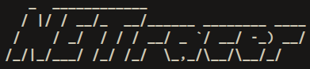
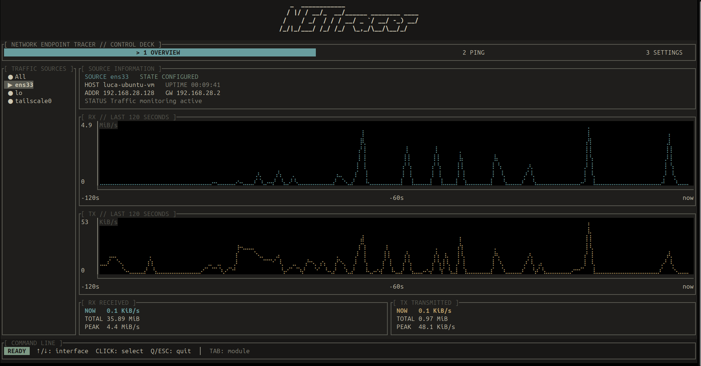
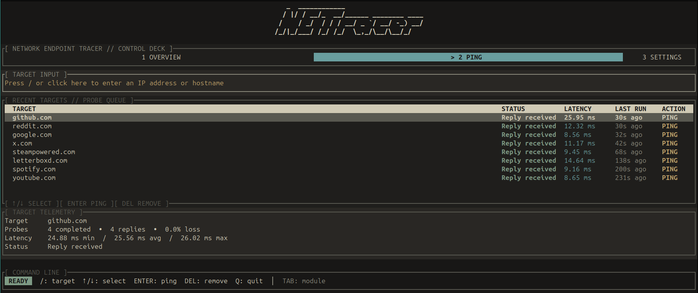
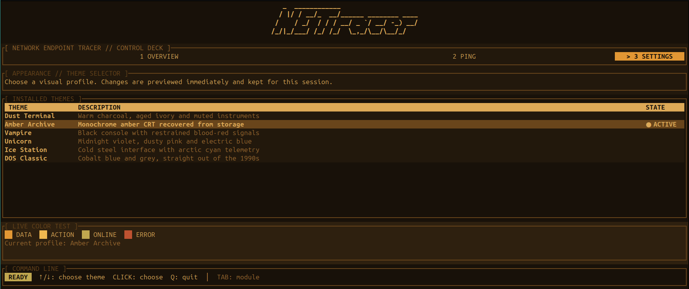
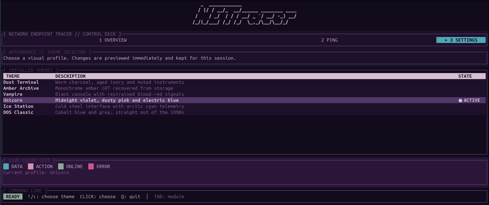

<p align="center">
  
</p>

## What is NETracer?

NETracer is basically a terminal application for monitoring network traffic and running network diagnostics, built with Rust + Ratatui.

I'm (Luca) personally building this to learn Rust, testing TUI, and just have fun along the way. Doing this journey with the help of GPT 5.6 Sol and GPT 6.0 Astra without letting them write everything.

The project is still in early developement, but you can already have fun monitoring your network interfaces, ping hosts, and try some themes.

## What can you do with NETracer?

### Monitor network traffic

The **Overview** tab shows live incoming and outgoing traffic, with graphs, transfer totals, and peak rates.

You can both select a single interface or look at the overall traffic by selecting the 'All' traffic source.



### Ping your hosts

The **Ping** tab lets you ping IPv4/IPv6 addresses and hostnames, inspect results, and rerun checks from your recent targets.

Recent targets are saved between sessions. Select one and press **Del** to remove it.



### CHANGE THEMES!

Networking tools deserve some personality too cmon! Open **Settings** and choose your favorite theme (DOS Classic is super cool, have a look by yourself).






## Requirements

- Linux.
- A recent stable Rust toolchain, including Cargo.
- The `ping` command provided by **iputils**.
- A terminal with Unicode and color support.

On Ubuntu/Debian, install iputils with:

```bash
sudo apt install iputils-ping
```

If you haven't installed Rust yet, follow the instructions at [rustup.rs](https://rustup.rs/).


## Installation
Clone the repository and install NETracer:

```bash
git clone https://github.com/LucaBTE/NETracer.git
cd NETracer
cargo install --path . --locked
```

Then launch it:

```bash
netracer
```

Make sure Cargo's binary directory (`~/.cargo/bin` by default) is in your `PATH`.

Alternatively, build and run directly from the repository:

```bash
cargo run --release --locked
```

## Controls

### General

| Key | Action |
| --- | --- |
| `Tab` / `Shift+Tab` | Switch between tabs |
| `1` / `2` / `3` | Open Overview / Ping / Settings when not editing a target |
| `Q` / `Esc` | Quit when not editing a target |
| `Ctrl+C` | Quit at any time |

You can also click a tab to open it.

### Overview

| Input | Action |
| --- | --- |
| `↑` / `↓` | Select a traffic source |
| Click an interface | Select that interface |

### Ping

| Input | Action |
| --- | --- |
| `/` or click the input field | Start entering a target |
| `Enter` while editing | Submit the target and run a ping |
| `Esc` while editing | Leave the input field |
| `↑` / `↓` | Select a recent target |
| `Enter` with a target selected | Run another ping |
| Click a target row | Run a ping for that target |
| `Del` with a target selected | Remove the target |
| Mouse wheel over the list | Move the selection |

Wait for the current ping to finish before starting another or removing a target.

### Settings

Use the arrow keys or click a theme to select it.

## Contributing

Feedback, bug reports, and contributions are welcome!

If you report a bug, please include:

- Your Linux distribution.
- Your terminal emulator.
- Steps to reproduce the issue.
- Any relevant error message.

Please remove personal or sensitive information from screenshots and logs before sharing them.


## License

NETracer is licensed under the [Apache License 2.0](LICENSE).